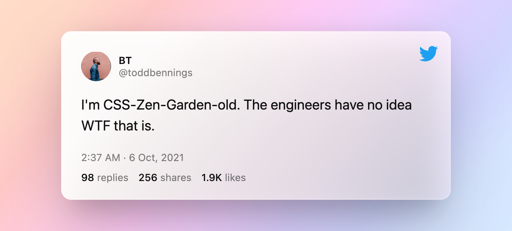
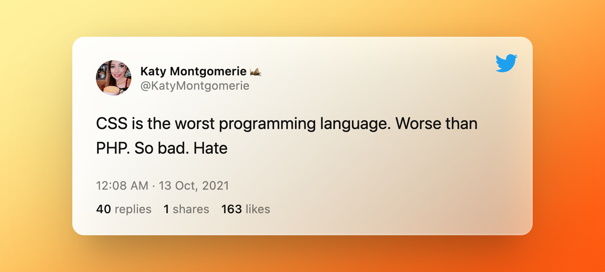

# The problem of CSS we try to solve

In this post you will learn why CSS is designed the way it is and why this troubles the young and aspiring web devloper. We will be discussing the ways in which current CSS libraries solve these problems and why they still give you a subtle nausea here and there.

## CSS, the good, the bad and the ugly

We all love to hate CSS just a little. It's gotten a bad rep lately—for good reasons—but that wasn't always the case. [CSS used to be the cool kid in town](http://www.csszengarden.com/). So what's changed? Let's take a look.

[](https://twitter.com/toddbennings/status/1445548636562071552)

## A bit of history

To understand why CSS is designed the way it is, we have to take a quick look at its history. In the olden days, the tech industry had to figure out how to display and store "rich text" on a computer. Rich text is text that allows styling words in bold or italic, adding "rich media" like images or videos and do layouting (i.e. determining text flow and placing things). The opposite of this is "plain text", which really can only show characters and does not provide any way to control the text layout of your text.

Working with rich text might sound very uninspiring today, but figuring out how to implement rich text was a big deal. Remember, there was a time where working with computers meant sitting infront of a terminal with a usually black background and a single colored text and that was it. And even with a graphical user interface, such as that of Windows 3.1, implementing rich text is by no means a trivial task.

To implement rich text you have to find an effecive way of rendering the text, which is a whole topic of its own and one that is incredibly advanced and not part of this article. But you also have to figure out how to store your text so you can tell your renderer which part of your text is bold, where you want to show an image and if you want that image to interrupt your text flow or be embedded in it.

There are a lot of approaches to do this. You might know `something.rtf` files, the `r`ich `t`ext `f`ormat from Windows. If you were to open it in your code editor, you would find something like this:

```rtf
 {\rtf1\ansi{\fonttbl\f0\fswiss Helvetica;}\f0\pard
 This is some {\b bold} text.\par
 }
```

which will render

> This is some **bold** text.

If I were to write the same text in Markdown, I would write

```markdown
This is some **bold** text.
```

Now what these two have in common is that we need to annotate the text _inline_ with our style definitions. This works well for many use-cases, I personally find writing markdown very pleasing, but imagine having to implement entire web apps with inline annotations. Also, especially on the web, it would be harder to separate semantics from styles, which might affect accessibility on one way or another.

Another way to do this is by separating these annotations from the text itself. This was already a practice before computers entered the stage. In publishing, as part of the [prepress](https://en.wikipedia.org/wiki/Prepress), typesetters could be given a sheet of styles that they would apply to the text when setting up the print.

## Enter CSS

Well, you now might already see where CSS is coming from. CSS spelled out, is Cascading _Style Sheets_. I know 🤯, right?

You might also get a feeling that CSS really is made for text documents, right? While that might not completely hold true today, to my understanding, this is what the crux of

[](https://twitter.com/KatyMontgomerie/status/1448047984642564104)

<sub>\* (Tweet chosen at random by googling "css worst twitter")</sub>

## Why CSS <del><em>is bad</em></del> does not fit our needs
